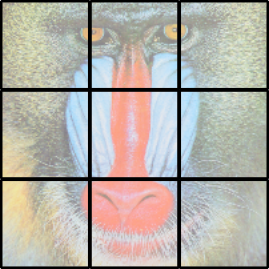
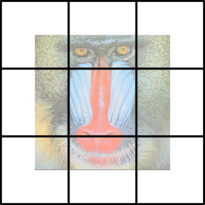

# An overview of the Registration framework

This is a bit of an overview of the main concepts that underlie
the overall registration framework.
`RegisterCore` itself only contains low-level utilities for working with "mismatch
data," as well as a few miscellaneous utilities.

## Mismatch

*Mismatch* refers to the mean-square pixelwise difference between two
images of the same size.  The mismatch is computed from two images,
called `fixed` and `moving`.
Suppose that `fixed` and `moving` are grayscale
two-dimensional images of size `m`-by-`n`. Computing the mismatch `D`
for a zero-pixel shift would result in a single number; computing for
shift by one pixel along the first coordinate (a shift of `(1,0)`)
would result in a different number. Using a `maxshift` of `(3,4)`, we
could store the mismatch for all possible shifts in an array `D` of
size `(7,9)`.

The [RegisterMismatch](https://github.com/HolyLab/RegisterMismatch.jl)
package contains a function

    D = mismatch(fixed, moving, maxshift; normalization=:intensity)

It computes the result of all translations by an integer number of pixels within a
range `-maxshift[i]:maxshift[i]` along coordinate `i`.

Let's do a simple example. Suppose your image data look like this:

```
julia> img = [0 0 0 0 0;
              0 0 1 0 0;
              0 2 1 1 0;
              0 0 3 0 0;
              0 0 0 0 0]
5×5 Array{Int64,2}:
 0  0  0  0  0
 0  0  1  0  0
 0  2  1  1  0
 0  0  3  0  0
 0  0  0  0  0
```

Let's compute the mismatch of this image as we shift it relative to itself.
Here we'll do this for shifts from -2 to 2 along each coordinate.
For ease of display let's convert the output to integer format,
though in practical work there would be no particular reason to do so:

```
julia> using RegisterCore, RegisterMismatch

julia> D = round.(NumDenom{Int}, mismatch(img, img, (2,2)))
5×5 CenterIndexedArrays.CenterIndexedArray{NumDenom{Int64},2,Array{NumDenom{Int64},2}} with indices SymRange(2)×SymRange(2):
 NumDenom(17,17)  NumDenom(22,22)  NumDenom(16,22)  NumDenom(22,22)  NumDenom(17,17)
 NumDenom(27,27)  NumDenom(18,32)  NumDenom(24,32)  NumDenom(22,32)  NumDenom(27,27)
 NumDenom(23,27)  NumDenom(26,32)  NumDenom(0,32)   NumDenom(26,32)  NumDenom(23,27)
 NumDenom(27,27)  NumDenom(22,32)  NumDenom(24,32)  NumDenom(18,32)  NumDenom(27,27)
 NumDenom(17,17)  NumDenom(22,22)  NumDenom(16,22)  NumDenom(22,22)  NumDenom(17,17)
```

This looks a little complicated, so let's walk through the pieces.

## CenterIndexedArray

Shift data are stored in a type called a `CenterIndexedArray`, in
which indexing is performed relative to the center.  Consequently,
`D[0,0]` (the center point) would correspond to the mismatch between `fixed` and `moving`
without any translational shift.
`D[1,0]`, displaced from the center by `(1,0)`, represents the
mismatch for a single-pixel shift of `moving` along the first
coordinate. Likewise, `D[-1,0]`
corresponds to an identical shift in the opposite direction.

## NumDenom

Mismatch computations actually return two numbers, conventionaly
called `num` and `denom` packed into a type called `NumDenom`.
`num` represents the "numerator" of the mismatch,
and always holds the sum-of-squared-differences.  In our example above,
you can check

```
julia> D[1,0].num
24

julia> sum((img[1:end-1,:] - img[2:end,:]).^2)
24
```

One key thing to note is that this sum-of-squared-differences
includes  *only overlapping pixels*.
In the example above, `D[2,0]` is `NumDenom(16, 22)`, and the 16
comes from

```
julia> sum((img[1:end-2,:] - img[3:end,:]).^2)
16
```
If you look at how we defined `img`, the pixel with value `3` is included in `img[3:end,:]` but omitted
from `img[1:end-2,:]`. If all you did was pay attention to the value of `D[2,0].num`, you might conclude
that a shift of `2,0` is better than a shift of `1,0`, even though the latter
is closer to the true ideal of `0,0`.

`denom` can be used for normalizing these differences,
and can follow one of two conventions. `:pixel`
normalization returns the number of valid pixels in the overlap
region, including the effects of any shift; for a shift of `(0,0)`
that would be `m*n`, but for a shift of `(1,0)` it would be `(m-1)*n`,
because we clip one row of each image.  `:intensity` normalization
computes the sum-of-square intensities within the overlap region. We can check
that directly for our example above:

```julia
julia> D[1,0].denom
32

julia> sum(img[1:end-1,:].^2 + img[2:end,:].^2)
32
```

`mismatch` uses a default normalization of `:intensity`, because that makes the
overall ratio `num/denom` a dimensionless quantity that does
not depend on the brightness of your illumination or the units used to report intensities.

While one might initially imagine returning the ratio `num/denom`
directly---thus computing the *fractional* square difference---there are several reasons to
return `num` and `denom` separately:

- If the shift is so large that there are no pixels of overlap between
  `fixed` and `moving`, both `num` and `denom` should be zero.
  However, because `num` and `denom` are generally computed by Fourier methods,
  there will be roundoff error (the reason we called `round` in the example above),
  and therefore their ratio can oscillate crazily.
  Returning them separately allows you
  to control the threshold for what is considered "signal" or "noise"
  (see `truncatenoise!` and related functions below). Indeed, by
  appropriate choice of threshold you can require a minimum finite
  overlap, for example in terms of numbers of pixels (for `:pixel`
  normalization) or amount of image intensity (for `:intensity`
  normalization). A particularly robust strategy is to use a threshold
  that is some fixed fraction of the total sum-squared power, e.g.,
  with `:intensity` normalization, `0.25*D[0,0].denom` would insist on shifts that
  achieve overap of at least 25% of the total power in the `fixed` and `moving` images.
- For sub-pixel registration, one might imagine *interpolating*
  the mismatch values to positions between grid points.  If we worked
  directly with the ratio `num/denom`, shifts where these two values
  are pure noise (due to little overlapping power) would contaminate
  adjacent shifts that are not noise.  By separately interpolating `num`
  and `denom` and *then* forming their ratio, we provide the opportunity
  for well-determined mismatch values to overwhelm the noise from
  shifts whose mismatch ratios are meaningless (i.e., `(bignum + noisenum)/(bigdenom + noisedenom)` is
  robust and nearly independent of the tiny noise contribution,
  whereas `bignum/bigdenom + noisenum/noisedenom` is likely to be meaningless).
- Mathematically, "apertured" (block) computation involves sums of `num`
  and `denom` arrays separately (see below).

To support interpolation and other operations, it is most efficient to give
`NumDenom` objects an algebra like a 2-vector (see [`NumDenom`](@ref)).
This *badly* violates any pretense that `nd` is equivalent to `nd.num/nd.denom`.
Consequently, the absence of a `convert(Float64, nd)` operation (which often gets called
"automatically") is deliberate;
use [`ratio`](@ref) or manual operations if you do want to "instantiate" them as a ratio.

## Apertured mismatch: computing mismatch in blocks

Mismatch can be computed as a whole, or over *apertures*. The basic
concept behind apertures is simple: given that an image may deform
differently in different portions of space, restrict the
mean-square-error computation to a local group of pixels.

Currently, apertures are arranged in a grid, although this may change
in the future.  Conceptually, if you want a (2,2) grid of blocks, you
break the `fixed` and `moving` images up into quadrants and compute
the mismatch separately for each quadrant. The actual implementation
is a bit more complex, but also a bit more useful:

- Apertures are not "clipped" before computing the mismatch as a function
  of shift; instead, clipping at boundaries effectively happens
  after shifting. This allows one to use all the information available
  in both images.
- One might naively assume that, when using a `gridsize` of (3,3),
  you might split the image up like this:



Instead, this suite of packages uses apertures like this:




In each aperture, the data used for comparison are symmetric around the
block center. As a consequence, the `[1,1]` aperture has 3/4 of its data
(upper-left, upper-right, and lower-left quadrants) missing. By
contrast, the `[2,2]` aperture does not have any missing data, and by
default the `[2,2]` aperture includes `9/16 = (3/4)^2` of the pixels in
the image (with the boundary at the halfway point between block
centers). The motivation for this convention is that it reduces the
need to *extrapolate* shifts, because the aperture centers span the
entire fixed image.

When the apertures are arranged in a grid pattern, the mismatch arrays
for each aperture can be stored in an array-of-arrays.  The "inner"
arrays have type `CenterIndexedArray{NumDenom{T}}` and are indexed by
shifts (of either sign).  The "outer" array is indexed in conventional
Julia style (starting at 1), where the index represents the grid block.

A deformation grid is represented as one shift for each aperture.
To support sub-pixel registration, the mismatch data are interpolated.

If you break the image up into blocks, each with its own mismatch array `Ds[I]`,
then the total sum of squared differences for a shift of `(0, 0)` is

```
sum(D[0,0].num for D in Ds)
```

and the total normalization is

```
sum(D[0,0].denom for D in Ds)
```
Consequently the `num/denom` ratio should be computed *after* summing all the individual contributions
to the numerator and denominator.

## NaN values

Any pixels with `NaN` values are omitted from mismatch computation,
for both the numerator and denominator. (Most of this framework was written long before
Julia had developed `missing`.)
This is treated quite differently from filling
`NaN`s with zero; instead, it's as if those pixels simply don't
exist. This provides several nice features:

- You can register a smaller image to a larger one by padding the
  smaller image with NaN. The registration will not be affected by the
  fact that there's an "edge" at the padding location.
- You can re-register a warped moving image to the fixed image (hoping
  to further improve the registration), and not worry about the fact
  that the edges of the warped image likely have NaNs.
- You can mark "bad pixels" produced by your camera.
